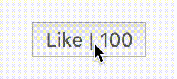

# React - Like button 
Criar um componente "like button" using React 16. O componente deve ser usar export default.

## Requisitos:
1. O "like button" deve:
- Ter um conteúdo seguindo o seguinte formato: "Like | 100", onde 100 é número o total de "like".
- Ter uma classe chamada "like-button".
- O número de "likes" deve estar contido em um `` com uma classe chamada "likes-counter".
- O número inicial de "likes" deve ser igual a 100.

2. Users can add a like. By clicking the button:
- O número de "likes" deve incrementar em 1 no valor total de "likes"
- A classe "liked" deve ser adicionada ao "like-button" (Pode ser usada a biblioteca classnames).

3. Users can undo their like by clicking again on the button:
- O contador deve decrementar em 1 do valor total de "likes"
- A classe "liked" deve ser removida do "like button".

## Observações:
- Acesse o [link](https://codesandbox.io/s/stp-interview-like-button-xpt8u) e faça o fork do projeto.
- Use o arquivo `LikeButton.jsx` para implementar o "like button" e adicione o componente no `index.js`.
- Apenas dois _imports_ no arquivo `LikeButton.jsx` são permitidos: React (v16.13.1) e classnames (v2.2.6). 
- Use a animação abaixo como referência para a sua solução.
- Design e estilo do componente não vai afetar o score. Se preocupe APENAS com os requisitos.
- A aba "Browser" do codesandbox irá mostrará o resultado do seu código e você poderá usar para propósitos de teste.

